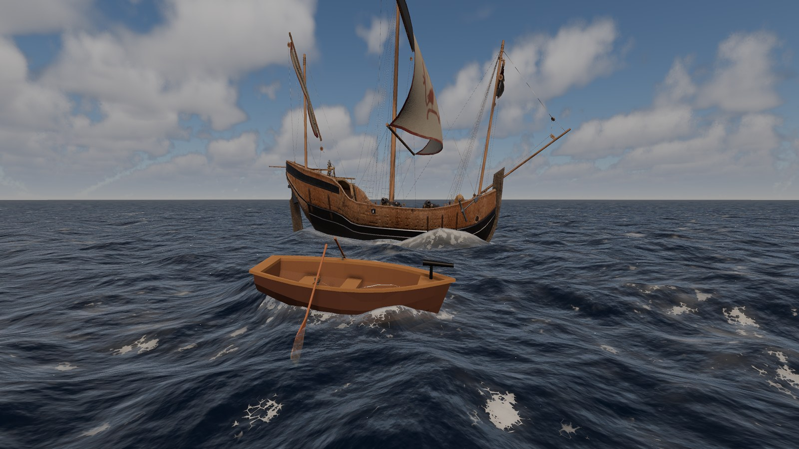
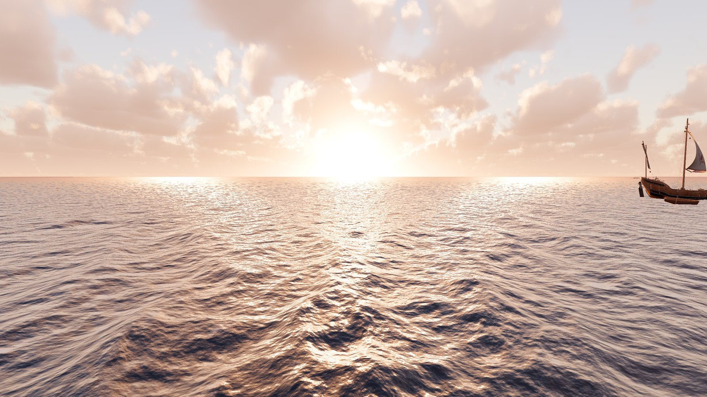
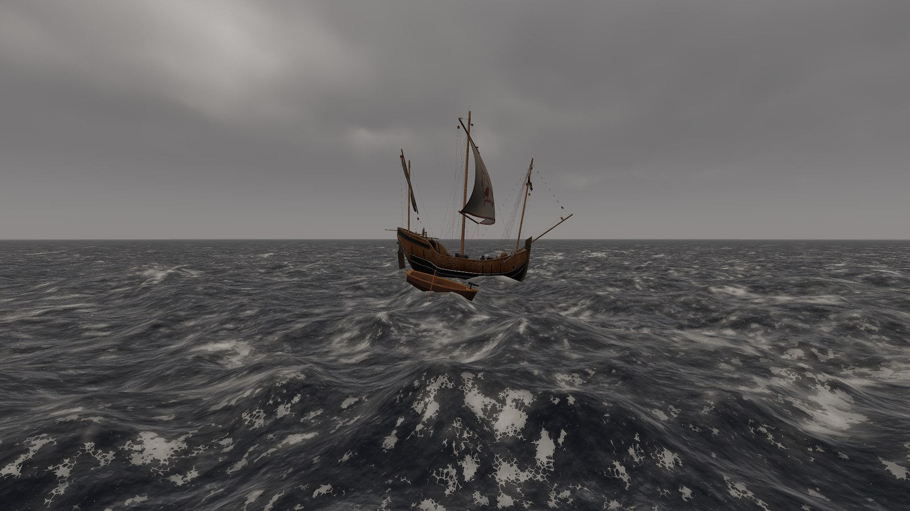
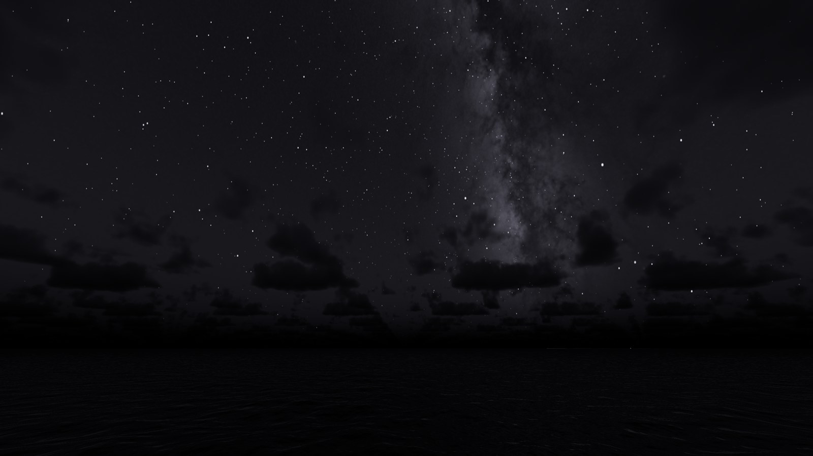

# Godot-RealisticEnvironments

A physically based open ocean for Godot 4.8: FFT waves out to a curved
horizon, a real sky with an atmosphere, volumetric clouds and the night sky,
eye-like exposure, and floating bodies and boats that ride it all.



| | |
| --- | --- |
|  |  |
|  | |

## Features

- **Ocean** (`ocean_system`): FFT wave cascades from a JONSWAP spectrum that
  follow the wind; a level-of-detail mesh to the real horizon; whitecaps, wake
  and bow foam; Kelvin wakes, bow waves and splash rings around hulls (iWave);
  water colour from absorption and scattering, glowing crests, refraction,
  caustics; sky, star and planet reflections with a rough-surface Fresnel;
  screen-space or planar reflections; sun glitter; Low / Medium / High shader
  tiers.
- **Sky** (`sky_system`): sun and moon placed astronomically, a physical
  atmosphere (blue sky, twilight, sea haze and fog, distance haze on the
  scene), volumetric clouds with seven blended weather presets, the 9,096
  naked-eye stars, the Milky Way, airglow and planets.
- **Exposure** (`exposure_system`): auto exposure from an incident-light
  meter, eye adaptation, darker nights as the eye sees them, rod night vision.
- **Floating things** (`buoyancy_system`, `boat_template`): probe buoyancy from
  asynchronous GPU water queries, sinking, a ready-wired boat with driving,
  stability, hull cutout, wake and bow spray. `hitbox_damage_system` gives
  ships grouped health.
- **Drop-in setup** (`ocean_environment`): wind, sky, ocean and exposure wired
  together in one scene. Plugins set up the project; misconfigured nodes show
  editor warnings.

Each addon's README lists its visual effects in detail and explains how it
works.

## Requirements

- Godot **4.8** with the **Forward+** renderer. The ocean, atmosphere and
  clouds run on compute shaders: the Compatibility renderer and headless runs
  have no water or sky. The Mobile renderer is untested.
- A desktop GPU. Developed and measured on Windows with an RTX 4070 Ti (the
  clouds cost about 0.5–0.8 ms of it at 1080p); other platforms are untested.
- Physical light units off (the default).

## Getting started

**Try it:** open the folder in Godot 4.8 and run the project (the demo,
`demo/main.tscn`), or open one of the examples:

| Example | Shows |
| --- | --- |
| `examples/ocean_only.tscn` | The drop-in environment and a fly camera |
| `examples/floating_objects.tscn` | Crates and barrels floating on probe buoyancy |
| `examples/boat.tscn` | A drivable boat (W A S D) built on the boat template |

The examples use only the open-source addons; `examples/README.md` explains
them.

**Use it in your project:**

1. Copy `addons/core` and the addons you want into your project's `addons/`
   folder (see the dependencies below and in each addon's README).
2. Enable them in **Project Settings > Plugins**. Enabling sets up the project
   for them and prints what it added: the sky's global shader uniforms and
   debanding, and the boat's default input actions. Nothing that is already
   set is changed.
3. Use the Forward+ renderer and keep physical light units off.
4. For a complete sea, instance `addons/ocean_environment/ocean_environment.tscn`
   (wind, sky, ocean and exposure, wired together) and add a `Camera3D` with a
   far plane beyond the horizon; see its README. Or instance a single addon's
   scene (`sky_system.tscn`, `ocean_system.tscn`, ...) and follow its README's
   quick start.

## The demo

`demo/main.tscn` is the development sandbox: the player's rowboat (one bow
swivel gun), a caravel you can shoot and sink, a buoy that shows its distance
to the player, a compass HUD (ship heading + wind), and a hidden debug panel
exposing most ocean, sky, wind, buoyancy and cascade parameters live. Its
weapons (`projectile_launcher_system`, `floating_boat_template`) are demo
gameplay, not part of the open-source addons.
`demo/ocean_optics_debug.tscn` is a lighter scene with just sky, wind, water, a
camera and the debug panel, for tuning water shading.

| Input | Action |
| --- | --- |
| W / S | Ship throttle forward / reverse |
| A / D | Ship turn left / right |
| Space | Fire the boat's guns at the aim marker (0.5 s cooldown) |
| Right mouse (hold) | Mouse look; the aim marker follows the screen center |
| C | Cycle camera: third person → first person → free look |
| Free look: W/A/S/D, R / F, Shift, mouse wheel | Fly, up / down, boost, change fly speed |
| H or \` | Toggle the ocean debug panel |
| F | Toggle fullscreen (also "down" in free look) |
| Esc | Leave fullscreen, release the mouse |

The wave simulation started as a fork of
[2Retr0/GodotOceanWaves](https://github.com/2Retr0/GodotOceanWaves) — see
`README_original.md` for the upstream write-up of the spectrum/FFT math and
`LICENSE_original` for its license.

## Repository layout

```
project.godot            Godot manifest (main scene, input map, physics layer names)
addons/                  Reusable systems, each self-contained with its own README
  core/                  Shared foundation: WaterSurface contract, RenderingDevice helpers
  ocean_system/          FFT ocean: compute pipeline, water shader, mesh, reflections, queries
  sky_system/            Day/night sky, atmosphere, sun + moon lights, starfield, astronomy, volumetric clouds
  wind_system/           Wind provider node with procedural gusts
  exposure_system/       Camera exposure from the scene's light meter, eye-like adaptation
  buoyancy_system/       Probe-based buoyancy, probe generation, sinking monitor
  hitbox_damage_system/  Hitboxes, grouped health, hit effects
  ocean_environment/     Drop-in scene: wind, sky, ocean and exposure wired together
  boat_template/         Boat scene that wires the systems together (driving, buoyancy, health, wake, spray)
  projectile_launcher_system/  (development only) Launchers, projectiles, aim solver, recoil, FX
  floating_boat_template/      (development only) The boat template plus weapons, for the demo
examples/                Small example scenes using only the open-source addons
systems/                 Demo-level support code: camera rig, debug panel, compass HUD
demo/                    Demo scenes, ship/buoy instances and third-party assets
tools/                   Development scripts (gd_lint.py: GDScript warnings via the editor's language server; bakers for the star catalog, the Milky Way and the example hull)
```

Each addon has a `README.md` describing what it does, how to use it and how it
works inside. `systems/README.md` covers the demo support code. `AGENTS.md`
holds the working rules for anyone (human or agent) changing the code;
`CONTRIBUTING.md` explains how to report problems and send changes, and
`CHANGELOG.md` lists what changed.

## How the pieces fit

```
WindSystem ──wind speed/dir──▶ OceanSystem ◀──sun/sky colors, clouds── SkySystem ◀── wind (cloud drift)
								   │  compute: spectrum → FFT → displacement/normal maps
								   │  shader:  displacement, foam, reflections, cutouts
								   │  iWave:   wakes and foam from HullWaterFootprint
								   ▼
		WaterSurface (core): submit_query / get_query_result   (GPU point query, async readback)
								   ▼
					 BuoyantBody (buoyancy + sinking) ── forces ──▶ RigidBody3D (FloatingBoat)
								   ▲            │ probe wet/dry states → your gameplay
								   │ group_destroyed
 ProjectileWeaponController        │
   └─ ProjectileLauncher ──projectile──▶ ProjectileHitbox ──▶ HitboxHealthManager
```

Systems never reference each other directly. What several of them share lives
in the `core` addon (the `WaterSurface` contract, RenderingDevice helpers);
everything else goes through duck-typed methods, node groups and signals. Each
addon can be dropped into another project with `core` alone (buoyancy also
needs some water in the scene that registers a `WaterSurface`), except
`ocean_environment` and `boat_template`, which compose them. The projectile weapons and the
`floating_boat_template` that adds them to the boat are the demo's gameplay and
not part of the open-source addons.

## License and credits

- **Code** (addons, examples, demo scripts, tools): MIT, `LICENSE`
  (© 2026 itzMeerkat). The wave simulation started from
  [2Retr0/GodotOceanWaves](https://github.com/2Retr0/GodotOceanWaves) by Ethan
  Truong, MIT, `LICENSE_original` (also in `addons/ocean_system/LICENSE`).
- **Demo models** (`demo/assets/`): CC BY 4.0, by Ginny Sutton ("Caravel
  Ship") and Muyaya Concept ("Stylized Low Poly Rowboat with Paddles", "Red
  Marine Navigation Buoy"); sources and details in `demo/assets/README.md`.
  The addons and examples do not use them.
- **Stars**: the Bright Star Catalogue, 5th Revised Ed. (Hoffleit & Warren
  1991; CDS catalogue V/50), baked by `tools/bake_star_catalog.py`.
- **Milky Way**: NASA/Goddard Space Flight Center Scientific Visualization
  Studio, Deep Star Maps 2020 (https://svs.gsfc.nasa.gov/4851), public domain;
  Gaia DR2: ESA/Gaia/DPAC. Baked by `tools/bake_milky_way.py`.
- **Example boat hull**: generated by `tools/make_example_hull.py` (MIT, like
  the code).
