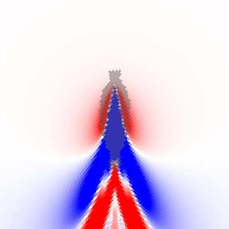
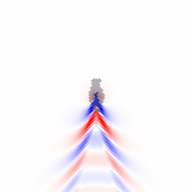
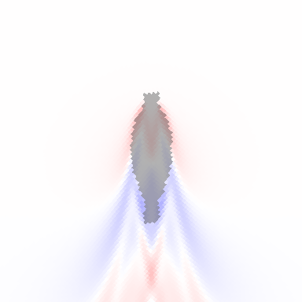
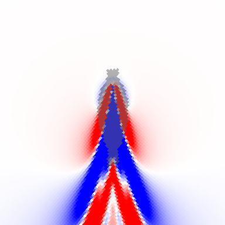
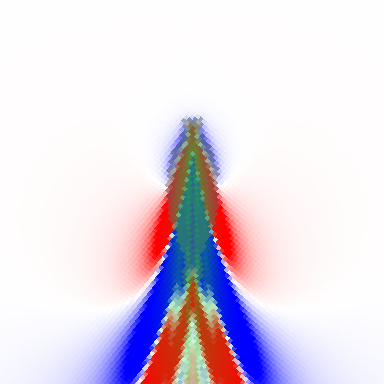
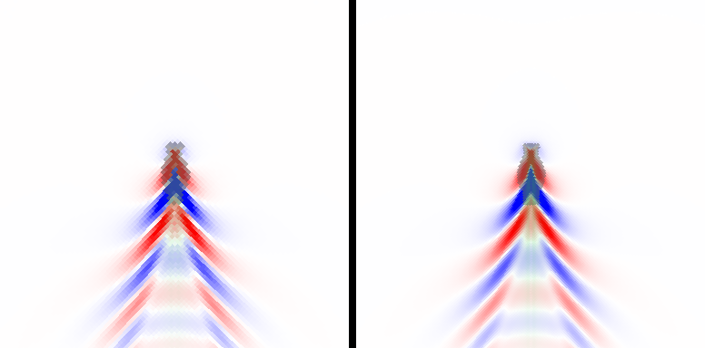
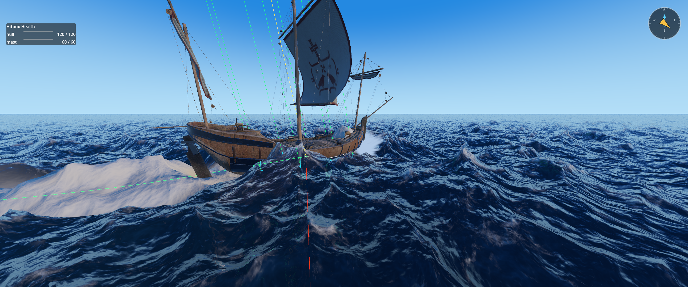

# Bow wave plan

Status: implemented (see Implementation notes) · Written 2026-09-30 · Target: Godot 4.7 Forward+

Moving hulls make a Kelvin wake behind the stern but no bow wave. This document
explains why, from measurements of the current simulation, and proposes how to
add the effect. Ground rules are the same as in `water-interaction-plan.md`:
no compatibility shims, no guard code that hides errors.

## Findings

### What the simulation does today

Measured on still water, boat at full throttle for 12 s, interaction height `h`
sampled in the boat's frame (red = raised, blue = lowered, grey = hull
coverage; bow points up):

| Caravel, 8 m/s | Rowboat, 4 m/s |
| --- | --- |
|  |  |

- Ahead of the stem, `h` is exactly 0 for both boats.
- The first disturbance at the bow is a **trough** (blue arms from the bow
  shoulders). The first crest is behind the stern (caravel +0.37 m, rowboat
  +0.13 m).

### Why

The simulation models a hull only as a **pressure patch**: `p` = the hull's draft,
which pushes the surface down to the keel (`h = −p` at rest). By linear
wave theory, a moving pressure patch makes a depression under itself and
radiates its first crest behind it. At ship speeds nothing propagates ahead of
it: in deep water, waves short enough to matter travel slower than the hull.
The model is right for the stern wake, and structurally unable to make a bow
wave.

A real bow wave has two causes:

1. **Stagnation (dynamic pressure).** Water meeting the advancing stem slows
   down and piles up by up to `U² / 2g` (Bernoulli): 0.8 m at 4 m/s, 3.3 m at
   8 m/s. Real bows reach a fraction of that (fine bows less), and the crest
   breaks into foam and spray. This is the dominant, visible effect.
2. **Displaced volume** (thin-ship theory). The hull pushes water sideways where
   it widens (a source at the bow) and lets it back where it narrows (a sink at
   the stern). In our model the displaced volume simply disappears into the
   pressure depression.

### Prototypes

Both prototypes were thrown away after measuring; nothing is left in the code.

**A. Put the displaced volume back** next to the hull (Gaussian spread of each
cell's `Δp` per step, outside the hull only, volume-normalized), with the
pressure patch kept: no visible change (max `h` 0.386 → 0.365). The source
and the depression are only 1–2 m apart. At wake wavelengths they form a
near-cancelling pair.

**B. Displaced volume only** (pressure forcing removed; the water inside the
hull is hidden by the cutout anyway): the pattern becomes physically shaped,
with a crest along the bow flanks and a trough at the stern. But it is tiny:
±0.04 m for the caravel at 8 m/s.

**C. Stagnation term added to the pressure patch.** In a band around the
waterline wall (two edge softnesses wide, reaching outside the hull), the
surface is lifted by `C · max(v·n, 0)² / 2g`. `v·n` is the wall's speed into the
water: hull velocity (from its transform history) projected on the waterline's
outward normal (from the profile's half-width slope). With `C = 0.5`:

- Caravel: a crest now runs along both bow flanks from the stem into the
  divergent wave arms; max `h` 0.386 → 0.527 m. The stern wake is unchanged.
- Rowboat: hardly any change (max `h` 0.151 → 0.165). Its bow is 1–2 cells wide
  at the default 0.5 m cell size, and at 4 m/s a fine bow's flanks meet the
  water at only ~1.4 m/s (`v·n = U sin(entrance angle)`), which gives
  centimeters.

**Conclusion.** Stagnation pressure is the right physical term and works for
large hulls. Small or slow boats need a visual layer as well: foam and spray at
the stem. That is also what players read as a bow wave on every boat size,
and it is how most shipped water games present it.

## Recommended design

Three layers. Each is useful on its own; together they cover large and small
boats.

### Layer 1: stagnation pressure in the simulation

**Hull kinematics.** `HullWaterFootprint` records its global transform every
physics tick and derives linear velocity and angular velocity (full 3D) from the
previous tick. This works for rigid bodies, kinematic and animated hulls
alike, with no dependency on physics nodes. Smooth them with a short low-pass
(τ ≈ 0.1 s). The forcing is quadratic in velocity, so collision jolts would
otherwise flash the bow wave.

**SimHull record.** Grows from 28 to 36 floats: `velocity` (xyz, w unused) and
`angular_velocity` (xyz, w unused) in world space, plus `bow_wave_strength` and
the rise cap in the currently unused `wake.zw`.

**Pressure pass.** In `iwave_pressure.glsl`, per covered cell:

- Point velocity `v = v_hull + ω × (x − hull origin)`, horizontal part,
  rotated into hull space. Vertical motion is already handled by `p` changing.
- Waterline outward normal: on the sides, `normalize(±1, −∂half_width/∂z)`
  from two extra profile taps at `u ± Δu` and the surface height. At and
  ahead of the stem, where the half-width goes to 0, the normal turns to the
  bow direction (end-distance gradient), so the stem itself gets the full `U`.
- `rise = min(C · max(v·n, 0)² / 2g, rise_cap)`, with `C = bow_wave_strength`
  (default 0.5, footprint export) and `rise_cap` (default 1.5 m, footprint
  export; real bow waves break long before `U²/2g` at high speed).
- Band weight: 1 at the wall, fading to 0 at two `wake_edge_softness` on both
  sides. The part outside the hull is what shows past the cutout.
- `p −= rise · band`. A negative pressure head lifts the surface. The existing
  `η` formulation then turns its motion into waves automatically: bow crest,
  divergent arms at the Kelvin angle, and rings when the hull yaws.
- Optional, small: Bernoulli suction along the midship sides (flow speeds
  up, the surface drops) deepens the classic shoulder trough. Leave out
  unless the tuning pass needs it.

Buoyancy is unaffected: the band lies inside the hull-coverage region, which
surface queries already exclude.

Cost: three extra texture taps and a few dozen ALU operations per covered cell;
cells outside hull circles are unchanged. Negligible next to the FFTs.

### Layer 2: resolution (optional quality setting)

At `interaction_cell_size = 0.5` a boat narrower than ~4 m has a sub-grid
bow. `interaction_grid_size = 1024` with `cell_size = 0.25` keeps the 256 m
window at 4× the cost. Measure the frame time before making it a default.
Offer it as a "high" preset and keep 0.5 m as the default. A nested fine
window around the player's boat would be cheaper but is a lot more complex; not
recommended now.

### Layer 3: bow foam and spray (visual)

**Bow foam from the simulation.** Today's bow-foam source,
`interaction_foam_pressure_rate × rising p`, fires where `p` rises: inside the
waterline, which the hull cutout hides. Replace it with a foam source from
the stagnation term: `foam += rate · rise · band` (outside the hull), plus the
existing slope foam, which will catch the new crest. This gives the white
"moustache" at the stem and foam along the divergent crest.
`interaction_foam_pressure_rate` is removed and `interaction_foam_bow_rate`
added.

**Spray particles: `BowSpray`** (new, `floating_boat_template`, since it
composes buoyancy and ocean):

- A `Node3D` placed at the stem, with a `GPUParticles3D` spray sheet (built in
  code like the muzzle flash and smoke effects).
- Continuous emission scales with the stem's speed into the water,
  `max(v_stem · forward − threshold, 0)`, and only while the stem's bow-tagged
  contact probe (`BuoyancyProbeState`, tag `bow`) is wet.
- Burst on `BuoyantBody.probe_entered_water(state)` for bow probes whose
  downward speed relative to the water exceeds a threshold (bow slamming
  into a wave), plus `OceanSystem.add_water_impulse()` at the stem for the
  splash ring.
- Emission direction: sideways-up from both sides of the stem, with velocity
  inherited from the hull.

The rowboat and caravel each get one `BowSpray` at the stem. The template
README describes placing it.

### Not recommended: procedural bow-wave displacement

A hull-local analytic bow-wave shape added in the water vertex shader (or a
bow-wave mesh) is sharp at any resolution and cheap. But it does not interact
with other waves, wakes or boats, it double-counts the simulated wave, and it
needs art tuning per hull. Keep it as a fallback only if layers 1 and 3 fall
short on small boats.

## Phases

1. **Hull kinematics.** `HullWaterFootprint` velocity and angular velocity
   (smoothed); SimHull grows to 36 floats; packing in
   `OceanSystem._pack_interaction_hulls`. No visible change.
2. **Stagnation pressure.** The pressure-pass term, the footprint exports
   (`bow_wave_strength`, `bow_wave_max_rise`), and stem normal handling.
   Verify with the field-dump harness (below): crest at the stem ≈
   `C · U² / 2g` (capped), unchanged stern wake, and still-water stability
   unchanged.
3. **Bow foam.** Replace the pressure-rise foam source with the stagnation foam
   source; tune `interaction_foam_bow_rate`.
4. **`BowSpray`.** Component, template wiring, placement on both demo boats.
5. **Tuning and quality.** Per-boat strengths, time the 0.25 m cell preset,
   docs (ocean README, template README, AGENTS.md).

## Verification

- **Field dump.** Drive a boat straight on still water and write `h` in its
  frame as a heatmap plus centerline samples (how the images above were made;
  needs `TEXTURE_USAGE_CAN_COPY_FROM_BIT` on the render texture, debug only).
  Check the crest height at the stem against speed at 2, 4 and 8 m/s.
- **Still-water stability.** The earlier still-water heave test must still
  settle: the new term is zero at rest and lies inside hull coverage.
- **Screenshots.** Third-person and top-down views at speed, calm and in
  waves.
- **Timing.** GPU time of the interaction step before and after (and with the
  0.25 m preset).

## Decisions

- **Bow waves are physically sized:** `bow_wave_strength = 0.5`, capped at
  1.5 m.
- **Nose-dives into waves** in heavy seas get dramatic spray, well above deck
  height. The spray stays physically motivated: jets at 2.5× the slam impact
  speed.
- **Resolution:** 512 × 0.5 m stays the default (see Implementation notes).

## Implementation notes (2026-09-30)

- **Layer 1** as designed.
  - `HullWaterFootprint` tracks `linear_velocity` / `angular_velocity` and has
    `get_point_velocity()`.
  - SimHull is 36 floats: `bounds.w` = sphere center y; `wake.zw` = strength and
    cap; the velocity of the bounds center; the angular velocity.
  - The pressure texture is RGBA32F: p, coverage, and the bow rise outside
    hulls.
  - Result on still water: caravel at 8 m/s +0.36 m at the stem (was −0.02),
    max `h` 0.39 → 0.63 m; rowboat at 4 m/s +0.28 m (was 0.01).
    Still-water stability is unchanged: both boats settle as before.

  

- **Layer 2.** Measured on an RTX 4070 Ti, physics at 600 Hz to amplify the
  per-step cost: 512 × 0.5 m ≈ 0.07–0.15 ms per step; 1024 × 0.25 m ≈
  0.25–0.27 ms per step, plus 64 MB instead of 16 MB of textures.
  - For the rowboat, the finer grid gives a smoother hull outline and crisper
    arms. The crest height is the same (0.28 m).
  - Kept 512 × 0.5 m as the default; 1024 × 0.25 m is documented as the
    high-quality option.

  

- **Layer 3a.**
  - `interaction_foam_pressure_rate` was replaced by
    `interaction_foam_bow_rate` (default 0.5). A first default of 1.5
    saturated the foam along the caravel's whole forward half.
- **Layer 3b.** `BowSpray` (`floating_boat_template`) runs its own one-point
  surface query instead of using the bow contact probes. It needs no probe at
  the stem and works on any hull.
  - Spray streaks are quads aligned to their velocity.
  - Slams need the stem to have been out of the water for `slam_rearm_time`.
  - Storm test (demo waves ×2, full throttle): rowboat slams every ~1.5–4 s at
    2–5 m/s; caravel slams of 3–10 m/s throw spray 3–16 m up (deck 3.2 m).

  

- **Seen in passing, not changed:** at 8 m/s in doubled waves, the caravel
  trails a wide saturated foam blanket. It is the same with the bow wave
  disabled: the slope foam of its steep stern wake. Worth a look when tuning
  interaction foam.
